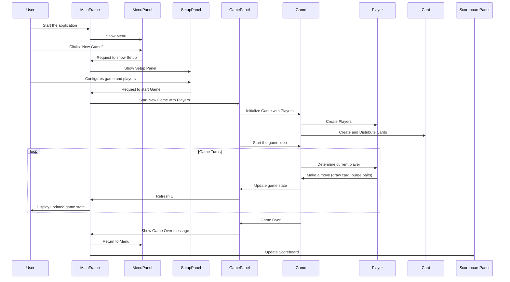

                                                                # Pouilleux - A Card Game

## Overview

Pouilleux is a Java-based card game, a variation of the "Old Maid" game. The application provides a graphical user interface for playing the game, supporting both player-vs-player and player-vs-AI modes. The game includes features such as replay logging, scorekeeping, and customizable settings for audio volume.

## Features

*   **Graphical User Interface:** User-friendly interface for playing the game.
*   **Player vs Player Mode:** Allows two or more human players to play against each other.
*   **Player vs AI Mode:** Enables playing against AI opponents with different difficulty levels.
*   **Replay Logging:** Records game sessions for later playback and analysis.
*   **Scoreboard:** Tracks player losses across multiple games.
*   **Settings:** Customizable audio volume for music and sound effects.

## Getting Started

### Prerequisites

*   Java Development Kit (JDK) 11 or higher
*   IntelliJ IDEA

### Running the Game

1.  **Clone the repository:**

    ```bash
    git clone <repository_url>
    cd pouilleux
    ```
2.  **Open the project in IntelliJ IDEA:**

    -   Open IntelliJ IDEA

    -   Select "File" > "Open" and navigate to the project folder

    -   Wait for IntelliJ to index the project and resolve dependencies

3.  **Run the game:**

    -   In the project explorer, navigate to  `src/core/gui/Main.java`

    -   Right-click on  `Main.java`  and select "Run 'Main.main()'"

    -   Alternatively, use the green run button in the editor

## Architecture

The application follows a Model-View-Controller (MVC) architecture:

*   **Model:** Contains the core game logic and data structures, including:
    *   [Card](https://github.com/Ardou0/pouilleux/blob/main/src/core/model/Card.java): Represents a playing card.
    *   [Deck](https://github.com/Ardou0/pouilleux/blob/main/src/core/model/Deck.java): Manages the deck of cards.
    *   [Player](https://github.com/Ardou0/pouilleux/blob/main/src/core/model/Player.java): Represents a player in the game.
    *   [Game](https://github.com/Ardou0/pouilleux/blob/main/src/core/model/Game.java): Implements the game logic.
*   **View:** The GUI components responsible for rendering the game state:
    *   [MainFrame](https://github.com/Ardou0/pouilleux/blob/main/src/core/gui/MainFrame.java): The main application window.
    *   [GamePanel](https://github.com/Ardou0/pouilleux/blob/main/src/core/gui/GamePanel.java): Displays the active game.
    *   [MenuPanel](https://github.com/Ardou0/pouilleux/blob/main/src/core/gui/MenuPanel.java): The main menu.
    *   [SetupPanel](https://github.com/Ardou0/pouilleux/blob/main/src/core/gui/SetupPanel.java): Configures players before starting a new game.
*   **Controller:** Handles user input and updates the model and view:
    *   [HumanStrategy](https://github.com/Ardou0/pouilleux/blob/main/src/core/gui/HumanStrategy.java): Manages human player actions.
    *   [GamePanel](https://github.com/Ardou0/pouilleux/blob/main/src/core/gui/GamePanel.java): ActionListener

Here is a sequence diagram to describe the architecture :


## [](https://talktogithub.com/Ardou0/pouilleux#core-packages)Core Packages

-   **core.gui:**  Contains all GUI-related classes, including panels, frames, and UI components.
-   **core.model:**  Defines the game's data model, including classes for cards, decks, players, and game logic.
-   **core.persistence:**  Manages data persistence, including replay logging and scorekeeping.